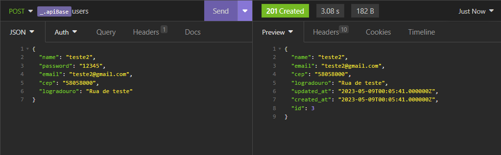
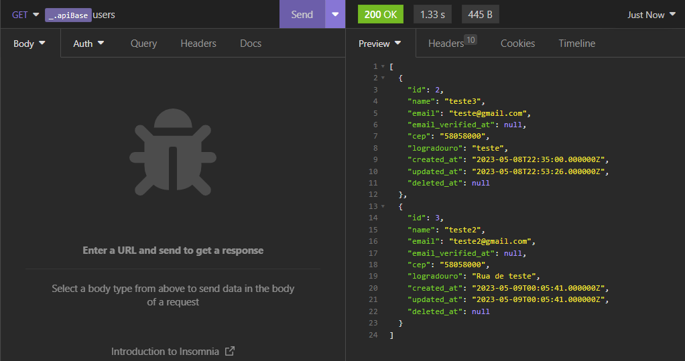
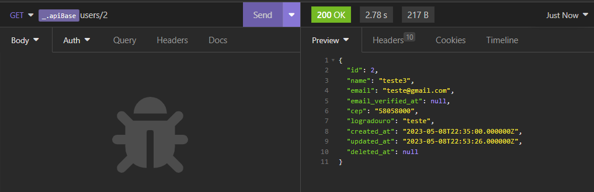
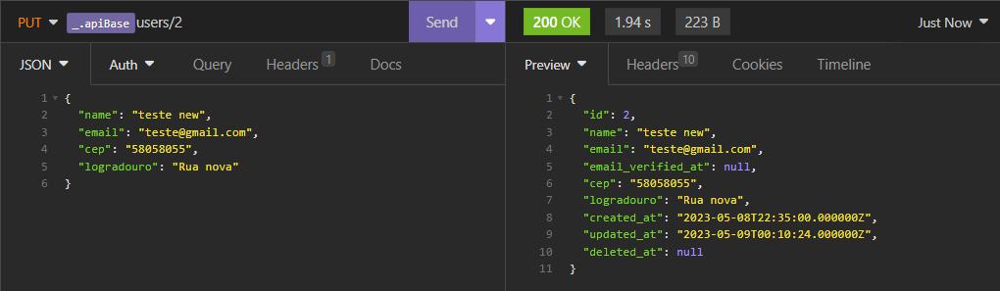
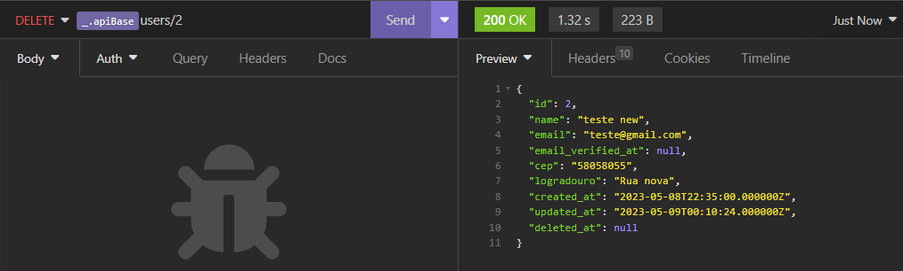

## API REST

API rest em laravel que contempla as operações de CRUD sobre usuários de um sistema.

## Exemplos

- Exemplo método Store. 
- Exemplo método Index. 
- Exemplo método Show. 
- Exemplo método Update. 
- Exemplo método Destroy. 

